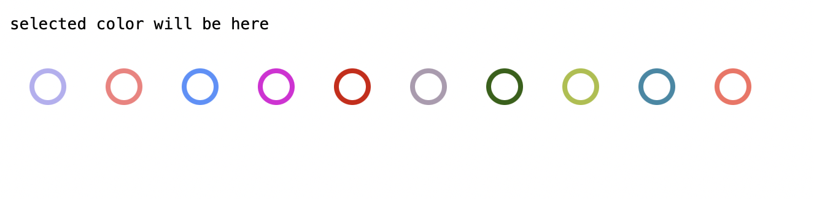

# NgxColorPaletteSelector

This project was generated with [Angular CLI](https://github.com/angular/angular-cli) version 12.0.5.

## How to use

Basic usage in a component:

html:
```html
<pre>{{ selected }}</pre>
<ngx-color-palette-selector [colors]="colors" [(selected)]="selected"></ngx-color-palette-selector>
```

typescript:
```typescript
public selected = 'selected color will be here';
public colors: string[] = [
  '#B4AFF2',
  '#F87D7D',
  '#5092FC',
  '#DF18D8',
  '#D41101',
  '#AC9AAF',
  '#2D6108',
  '#ABBF3C',
  '#3189A6',
  '#F96E61',
];
```



Select any color, and the color code will be put in the `selected` variable.

## Local demo

Run `ng serve` and navigate to `http://localhost:4200/`.

## Build

Run `ng build` to build the project. The build artifacts will be stored in the `dist/` directory.
